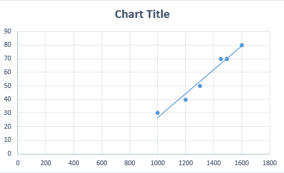
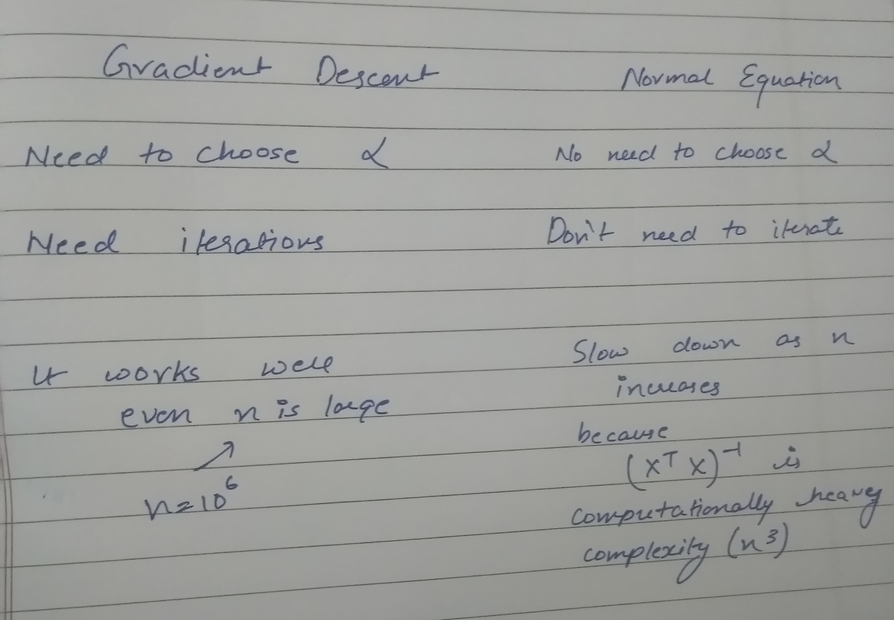

# Linear Regression

It models the relationship between two variables by fitting a line.

Now suppose you have the following Data.

Now we will plot that data it will look like this

In the graph. x axis represents the area of the house while y axis represents the price. The variable is the x axis is also known as independent variable. The variable in the y axis is known as dependent variable. 
If we try to fit a line through this data as below

Now we can found a relationship between the housing area and cost. We can predict the cost of the new house by the housing area.

We know the equation of the lines as 
Y = mx + c where c is intercept and m is the slope
Now to generalize These are some annotation

The above equation is the cost function, Our task is to minimize the cost functoion. For that there are two method Gradient Descent and Normal equation

## Gradient Descent
Imagine you are standing on a hill top and you want to take a small step to the direction of the steepest descent which can take you downhill as soon as possible. Gradient descent does the same. You start at a point apply gradient descent and end up at a new point and repeat the same until you reach to the minimum point.

Alpha in above equation is the learning rate. It’s like how large the steps you want to take while descending down the hill. If you take steps too small, it will take long time to descend down the hill. If you take steps too large you may overshoot the local minima.

Image Represent the Gradient Descent

## Normal Equation
As gradient Descent is iterative apporach. The normal equations find the value of parameters(a) in one go.

The derivation is explained in the link [https://eli.thegreenplace.net/2014/derivation-of-the-normal-equation-for-linear-regression]
## Comparison between two approaches

